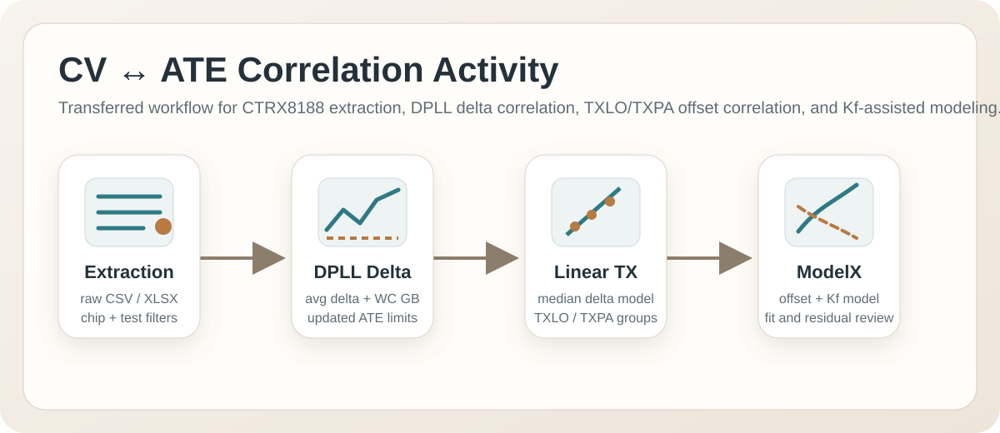
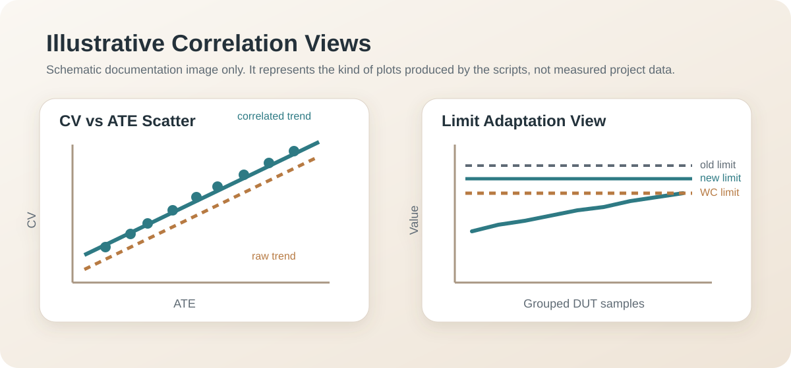

# CV_ATE_Correlation

Repository dedicated to the CTRX8188 CV versus ATE correlation activity that was previously kept in `Tasks_Automation_Code/IFX_Scripts/8188_CV_ATE_Correlation`.

This migration was done with preserved git history for the transferred folder, then completed with repository-local documentation and visuals.



## What This Activity Covers

The work in this repository supports correlation between characterization / CV data and ATE production-test data for several CTRX8188 use cases:

- DPLL phase-noise correlation
- TXLO power correlation
- TXPA power correlation
- Kf-assisted correlation for PA / LO behavior
- Raw TE data extraction for selected DUTs, wafers, coordinates, and test ranges

At a high level, the activity follows this flow:

1. Extract relevant ATE raw data for the DUT population and tests of interest.
2. Build Excel workbooks that align CV and ATE measurements on common keys such as DUT number, wafer, X/Y, temperature, voltage corner, frequency, and test number.
3. Run one of the correlation scripts depending on the parameter family under study.
4. Review the generated Excel summaries, row-level residual tables, updated limits, and per-group plots.



## Repository Contents

| File | Purpose |
| --- | --- |
| `Tests_Data_Extractor_Flat.py` | Extracts targeted ATE raw data from `.xlsx` and `.csv` inputs for selected DUTs and test ranges, then writes a consolidated Excel workbook. |
| `CV_ATE_Correlation_DPLL.py` | Performs delta-based CV ↔ ATE correlation for DPLL phase-noise data and derives updated ATE high limits plus worst-case guard-band limits. |
| `CV_ATE_Correlation_Linear_TXLO_TXPA.py` | Performs offset-only median-delta correlation for TXLO / TXPA power data and derives correlated limits plus residual-based guard-bands. |
| `CV_ATE_Correlation_ModelX_TXLO_TXPA.py` | Extends the TXLO / TXPA power flow with a model-based correlation using both offset correction and a Kf-based physics-informed model. |

## Activity Breakdown

### 1. Raw TE Data Extraction

`Tests_Data_Extractor_Flat.py` is the preparation step for the downstream analysis.

What it does:

- reads all `.xlsx` and `.csv` files from an input folder
- removes non-data header / spacer rows used in the TE export format
- filters for selected devices using `Wafer`, `X`, and `Y`
- filters the requested tests using explicit numbers, ranges, or name fragments
- normalizes metadata such as temperature, LUT value, supply corner, and optional DoE split / DUT number information
- writes a single consolidated Excel workbook for later correlation processing

Typical output columns include:

- `Wafer`
- `X`
- `Y`
- `TestName`
- `TestNumber`
- `TestValue`
- `LUT value`
- `Temperature`
- `SupplyVoltage`

### 2. DPLL Phase-Noise Correlation

`CV_ATE_Correlation_DPLL.py` handles the DPLL phase-noise use case when CV and ATE values are stored in the same sheet.

Per correlation group, it computes:

$$
\Delta = CV - ATE
$$

$$
ATE_{High,New} = ATE_{High,Old} - \operatorname{mean}(\Delta)
$$

$$
WC_{GB} = \max_i\left|\Delta_i - \operatorname{mean}(\Delta)\right|
$$

$$
ATE_{High,WC} = ATE_{High,New} - WC_{GB}
$$

Grouping is done by test case through:

- `Test Number`
- `Voltage corner`
- `Frequency_GHz`
- `Temperature`

Outputs:

- Excel summary with one row per group
- Excel detail table with row-level deltas
- PNG plots per group showing CV, ATE, old limits, updated limits, and worst-case limits

### 3. Linear TXLO / TXPA Correlation

`CV_ATE_Correlation_Linear_TXLO_TXPA.py` uses a robust offset-only model based on the median delta between CV and ATE.

Core relation:

$$
\Delta = CV - ATE
$$

$$
CF = \operatorname{median}(\Delta)
$$

$$
ATE_{correlated} = ATE + CF
$$

Residuals are then computed as:

$$
Residual = \Delta - CF
$$

This flow is used for TXLO and TXPA power correlation, with automatic grouping support for either:

- TXLO by `Test Number`, `Voltage corner`, `Frequency_GHz`, `Temperature`
- TXPA by `LUT value`, `Voltage corner`, `Frequency_GHz`, `Temperature`

The script also derives new correlated limits and handles requirement-based special cases such as:

- LO maximum power at `LO IDAC = 112`
- PA maximum power at `LUT value = 255`

Outputs:

- factor / limit summary sheet
- row-level correlated data sheet
- group plots with raw values, corrected values, regression view, and residuals

### 4. ModelX / Kf-Assisted TXLO / TXPA Correlation

`CV_ATE_Correlation_ModelX_TXLO_TXPA.py` expands the offset-only approach with a second model that uses Kf as an explanatory parameter.

Two models are evaluated per group:

1. Offset-only model

$$
CV_{pred} = ATE + \operatorname{median}(CV - ATE)
$$

2. Kf-assisted model

$$
CV_{pred} = ATE - (\alpha K_f + \beta)
$$

with coefficients fitted from:

$$
ATE - CV = \alpha K_f + \beta
$$

This script merges an additional Kf sheet into the CV/ATE dataset and compares model quality using residuals and goodness-of-fit metrics.

Outputs:

- group-level coefficient and fit summary workbook
- row-level workbook with predicted values and residuals
- per-group PNG plots for raw/correlated views and model residual analysis

## Expected Inputs

The transferred scripts are analysis utilities, not standalone datasets. They expect local input workbooks such as:

- extracted ATE workbooks
- CV / ATE aligned correlation workbooks
- DUT chip-list workbooks
- optional Kf lookup sheets

Most of the script configuration is done directly inside the files through the `USER CONFIG` block at the top of each script.

## Dependencies

The scripts mainly rely on:

- `pandas`
- `matplotlib`
- `openpyxl` via `pandas.ExcelWriter`

Recommended setup:

```bash
python -m venv .venv
.venv\Scripts\activate
pip install pandas matplotlib openpyxl
```

## Important Notes

- The original source folder contained scripts only. It did not contain the confidential raw CV / ATE workbooks or pre-generated plot folders.
- For that reason, this repository documents the activity and transferred the script logic, but it does not include measured-data Excel files or real generated plots.
- The SVG images in `docs/images/` are illustrative repository visuals created for documentation. They are not measurement results.
- Several scripts still contain the original absolute analysis paths inside their `USER CONFIG` section. Update those paths locally before running them in a new environment.

## Transfer Summary

This repository was populated from:

- source repository: `Tasks_Automation_Code`
- source path: `IFX_Scripts/8188_CV_ATE_Correlation`

The folder history was preserved during migration before the new README and documentation assets were added.
